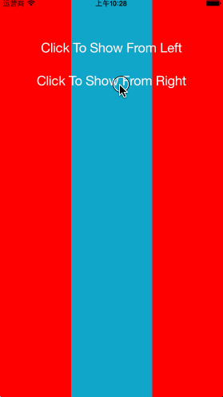
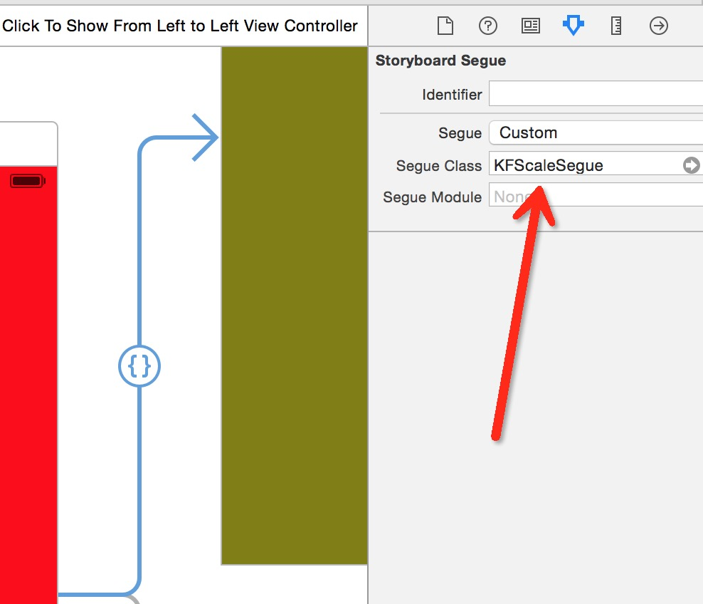

# KFScaleSegue

[](https://travis-ci.org/Khiyuan/KFScaleSegue)
[](http://cocoapods.org/pods/KFScaleSegue)
[](http://cocoapods.org/pods/KFScaleSegue)
[](http://cocoapods.org/pods/KFScaleSegue)
## Description
Segue used in storyboard, scale old controller's view and show it's snapshot in new view;


## Usage

To run the example project, clone the repo, and run `pod install` from the Example directory first.

### Step One
In storyboard, create a custom segue with class: KFScaleSegue



### Step Two
In Left or Right View, import a category of UIViewController

```objective-c
#import "UIViewController+KFScaleSegue.h"
```

### Step Three
Implement Protocal KFScaleSegueDelegate which is already import in **UIViewController+KFScaleSegue.h**

#### Direction define:
```objective-c
typedef NS_ENUM(NSInteger, KFScaleSegueMoveDirection) {
    KFScaleSegueMoveFromLeft,
    KFScaleSegueMoveFromRight
};
```
#### Protocal methods:
In left side viewcontroller

```objective-c
#pragma mark - KFScaleSegueDelegate
-(KFScaleSegueMoveDirection)kf_DirectionToMove{
    return KFScaleSegueMoveFromLeft;
}
-(CGFloat)kf_ScaleOfHoldView{
	return 0.8f;
}
-(CGFloat)kf_WidthRemainOfHoldView{
	return 96.f;
}
```


## Requirements
###### iOS >= 7.0


## Installation

KFScaleSegue is available through [CocoaPods](http://cocoapods.org). To install
it, simply add the following line to your Podfile:

```ruby
pod "KFScaleSegue"
```

## Author

K6F, Fan.Khiyuan@gmail.com

## License

KFScaleSegue is available under the MIT license. See the LICENSE file for more info.
